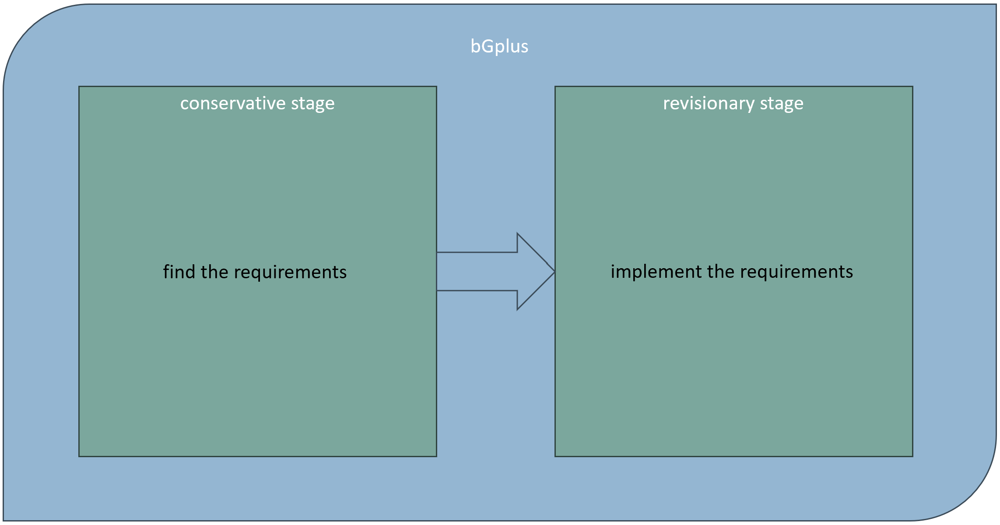

# bGPlus - Process Description (OXi TEST) {#Bookmark1 .page-title-lvl-cover}
:::

::: wiki-content
::: {.confluence-information-macro .confluence-information-macro-note}
[]{.aui-icon .aui-icon-small .aui-iconfont-warning
.confluence-information-macro-icon}

::: confluence-information-macro-body
Warning - The narratives below are just samples for testing. No text has
been signed off.
:::
:::

[]{#Bookmark2}

# Process Description {#Bookmark2}

As stated previously, since we can't find a **comprehensive graph
theory** in the current literature, we need to explore the sources
available in the field to **find the requirements** of what a
comprehensive graph theory would look like (*conservative stage*), in
order to **implement those requirements** in the next stage
(*revisionary stage*) as a base of our bG+ infrastructure (See Fig.1).

::: {.panel style="border-width: 1px;"}
::: {.panelHeader style="border-bottom-width: 1px;"}
**Process Diagrams - BG plus (Alternate)**
:::

::: panelContent
[{.confluence-embedded-image
.image-center width="624"
height="327"}]{.confluence-embedded-file-wrapper .image-center-wrapper
.confluence-embedded-manual-size}

*Fig. 1 - bGPlus major stages*
:::
:::

[]{#Bookmark3}

## bGPlus Major Stages {#Bookmark3}

-   [bGPlus - Process Description - Revisionary
    Stage](../page5951062017#Bookmark8 "bGPlus - Process Description - Revisionary Stage"){linked-resource-id="5951062017"
    linked-resource-version="1" linked-resource-type="page"}
-   [bGPlus - Process Description - Conservative
    Stage](../page5950930948#Bookmark4 "bGPlus - Process Description - Conservative Stage"){linked-resource-id="5950930948"
    linked-resource-version="2" linked-resource-type="page"}
-   [bGPlus - Test Picture
    Storage](../page5950963721#Bookmark9 "bGPlus - Test Picture Storage"){linked-resource-id="5950963721"
    linked-resource-version="1" linked-resource-type="page"}
:::
:::
:::
:::
