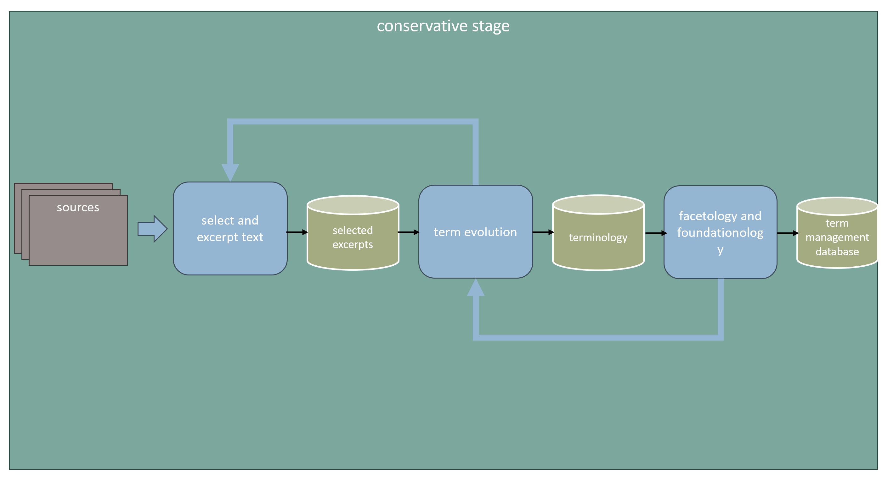

# bGPlus - Process Description - Conservative Stage {#Bookmark4 .page-title-lvl-cover}
:::

::: wiki-content
[]{#Bookmark5}

# Conservative Stage {#Bookmark5}

The bG+ conservative stage aims to define the requirements of what a
comprehensive graph theory would look like, and we could use the field
**terminology** as a proxy for doing that.

Using the current field terminology we can

-   find out the **requirements** for a comprehensive theory

-   define our **scope of work**

-   build a **preferred terminology**, getting rid of any ambiguities

The process for it is described in Fig. 2.

[{.confluence-embedded-image
.image-center width="624"
height="336"}]{.confluence-embedded-file-wrapper .image-center-wrapper
.confluence-embedded-manual-size}[]{#Bookmark6}

## Process Description {#Bookmark6}

...

[]{#Bookmark7}

### Collect Selected Excerpts {#Bookmark7}

...
:::
:::
:::
:::
