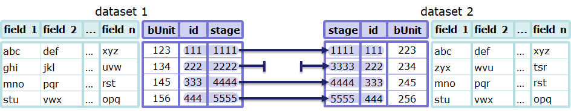
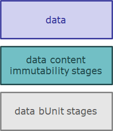
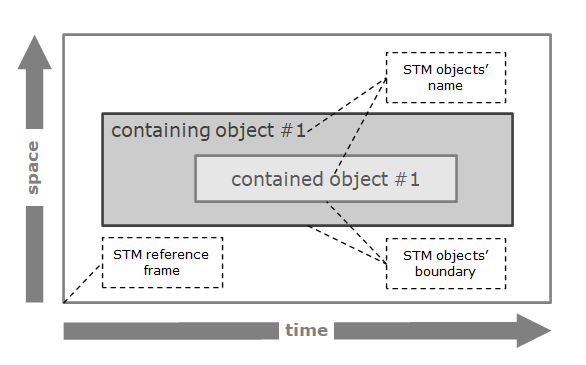
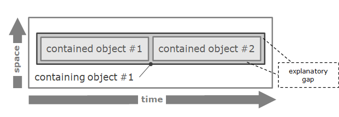
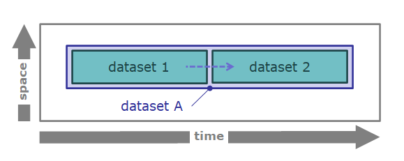

# TtDT - Report - Appendix - Reference Iconography - Report - Life history

## Identity tracking/tracing - general

### Components

    <table border="1" border="1" class="confluenceTable" data-local-id="129d4894-a1ad-469d-9073-0cbac77e9be8" data-layout="wide"
        style="font-size:1.0em">
        <tbody>
            <tr class="header">
                <th class="confluenceTh">
                    
<strong>iconography object
                            names</strong>

                </th>
                <th class="confluenceTh">
                    
<strong>iconography
                            objects</strong>

                </th>
                <th class="confluenceTh">
                    
<strong>notes</strong>

                </th>
            </tr>
            &#10;<tr class="odd">
                <td class="confluenceTd" style="padding: 0.5em">
                    <h4 id="Bookmark173">inspection</h4>
                </td>
                <td class="confluenceTd" style="padding: 0.5em">
                    
single object:

                    
                </td>
                <td class="confluenceTd" style="padding: 0.5em">
                    
this rectangular shape with the
                            “inspection” name surrounds processes that relate to data
                            inspection

                    
see in-context
                            example

                </td>
            </tr>
            <tr class="even">
                <td class="confluenceTd" style="padding: 0.5em">
                    <h4 id="Bookmark174">tracking/ 
                        mapping <strong></strong></h4>
                </td>
                <td class="confluenceTd" style="padding: 0.5em">
                    
single object:

                    
                </td>
                <td class="confluenceTd" style="padding: 0.5em">
                    
The tracking/ 
                        mapping arrow represents the trace of data. Where there is a discontinuity in the
                            trace, the arrow is “T-shaped” as shown in the in-context example

                </td>
            </tr>
        </tbody>
    </table>

### In-context examples

    <table border="1" class="confluenceTable" data-local-id="8857ca0b-db51-4613-9a86-741482c74205" data-layout="wide"
        style="font-size:1.0em">
        <tbody>
            <tr class="odd">
                <td class="confluenceTd" data-highlight-colour="#f4f5f7" style="padding: 0.5em">
                    
<strong>diagrams</strong>

                </td>
                <td class="confluenceTd" data-highlight-colour="#f4f5f7" style="padding: 0.5em">
                    
<strong>notes and examples</strong>

                </td>
            </tr>
            <tr class="even">
                <td class="confluenceTd" style="padding: 0.5em">
                    <h4 id="Bookmark176">inspection</h4>
                </td>
                <td class="confluenceTd" style="padding: 0.5em"></td>
            </tr>
            <tr class="odd">
                <td class="confluenceTd" style="padding: 0.5em">
                    <h4 id="Bookmark177">dataset tracking/ 
                        mapping <strong></strong></h4>
                </td>
                <td class="confluenceTd" style="padding: 0.5em"></td>
            </tr>
        </tbody>
    </table>

## Identity tracking/tracing - in life history space-time diagrams

### Components

    <table border="1" class="confluenceTable" data-local-id="391182c9-e5e3-4691-afe6-ab36ed89cf1a" data-layout="wide"
        style="font-size:1.0em">
        <tbody>
            <tr class="header">
                <th class="confluenceTh">
                    
<strong>iconography object
                            names</strong>

                </th>
                <th class="confluenceTh">
                    
<strong>iconography
                            objects</strong>

                </th>
                <th class="confluenceTh">
                    
<strong>notes</strong>

                </th>
            </tr>
            &#10;<tr class="odd">
                <td class="confluenceTd" style="padding: 0.5em">
                    <h4 id="Bookmark180">identity transformation types palette</h4>
                </td>
                <td class="confluenceTd" style="padding: 0.5em"></td>
                <td class="confluenceTd" style="padding: 0.5em">
                    
This palette applies
                        to space-time extensions represented in a <a
                            href="https://borocvi.atlassian.net/wiki/spaces/bie/pages/5796298761/TtDT+-+Report+-+Appendix+-+Reference+Iconography+-+Report+-+Life+history#life-history-space-time-diagram"
                            rel="nofollow"
                            title="https://borocvi.atlassian.net/wiki/spaces/bie/pages/5796298761/TtDT+-+Report+-+Appendix+-+Reference+Iconography+-+Report+-+Life+history#life-history-space-time-diagram">life
                            history space-time diagram</a>. It can be used to track identities
                        visually.

                </td>
            </tr>
            <tr class="even">
                <td class="confluenceTd" style="padding: 0.5em">
                    <h4 id="Bookmark181">trace link</h4>
                </td>
                <td class="confluenceTd" style="padding: 0.5em"></td>
                <td class="confluenceTd" style="padding: 0.5em">
                    
This icon can
                            be used to
                        trace identities in a <a
                            href="https://borocvi.atlassian.net/wiki/spaces/bie/pages/5796298761/TtDT+-+Report+-+Appendix+-+Reference+Iconography+-+Report+-+Life+history#life-history-space-time-diagram"
                            rel="nofollow"
                            title="https://borocvi.atlassian.net/wiki/spaces/bie/pages/5796298761/TtDT+-+Report+-+Appendix+-+Reference+Iconography+-+Report+-+Life+history#life-history-space-time-diagram">life
                            history space-time diagram</a>.

                </td>
            </tr>
        </tbody>
    </table>

### In-context examples

    <table border="1" class="confluenceTable" data-local-id="5df6f5ba-a32a-407f-bf1d-b8c49dd93923" data-layout="wide"
        style="font-size:1.0em">
        <tbody>
            <tr class="odd">
                <td class="confluenceTd" data-highlight-colour="#f4f5f7" style="padding: 0.5em">
                    
<strong>diagrams</strong>

                </td>
                <td class="confluenceTd" data-highlight-colour="#f4f5f7" style="padding: 0.5em">
                    
<strong>notes and examples</strong>

                </td>
            </tr>
            <tr class="even">
                <td class="confluenceTd" style="padding: 0.5em">
                    <h4 id="Bookmark183">BORO Space
                            Time Map</h4>
                </td>
                <td class="confluenceTd" style="padding: 0.5em">
                    
note: the life history space-time
                                diagram iconography is based on the BORO Space Time Maps (bSTM)
                            iconography, which provides a way to visualise four-dimensional objects.
                        

                    
A typical space-time
                            map:

                    <ul>
                        <li>
                            
contains a space-time
                                    map (STM) reference frame to locate objects in spacetime

                        </li>
                        <li>
                            
shows STM objects' space time boundaries (or
                                    extensions).

                        </li>
                        <li>
                            
shows STM objects' names

                        </li>
                    </ul>
                    
Example:

                    
                    
Where space-time boundaries coincide (in the example below, the
                        space-time extension of containing object #1 coincides with the
                        space-time extension of contained objects #1 and #2), an explanatory gap
                        between boundaries is used.

                    
                </td>
            </tr>
            <tr class="odd">
                <td class="confluenceTd" style="padding: 0.5em">
                    
life-history space
                        time diagram

                </td>
                <td class="confluenceTd" style="padding: 0.5em">
                    
A life history
                        space-time diagram is typically a BORO Space Time
                            Map enriched with
                        tracking/tracing icons.

                    
In the example below:

                    <ul>
                        <li>
                            
the trace link icon between the extensions of dataset 1 and
                                dataset 2 indicates the predecessor and successor in the
                                transformation

                        </li>
                        <li>
                            
space-time extensions for dataset 1, dataset 2 and dataset A are
                                coloured according to the identity transformation types
                                palette.

                        </li>
                    </ul>
                    
                </td>
            </tr>
        </tbody>
    </table>

